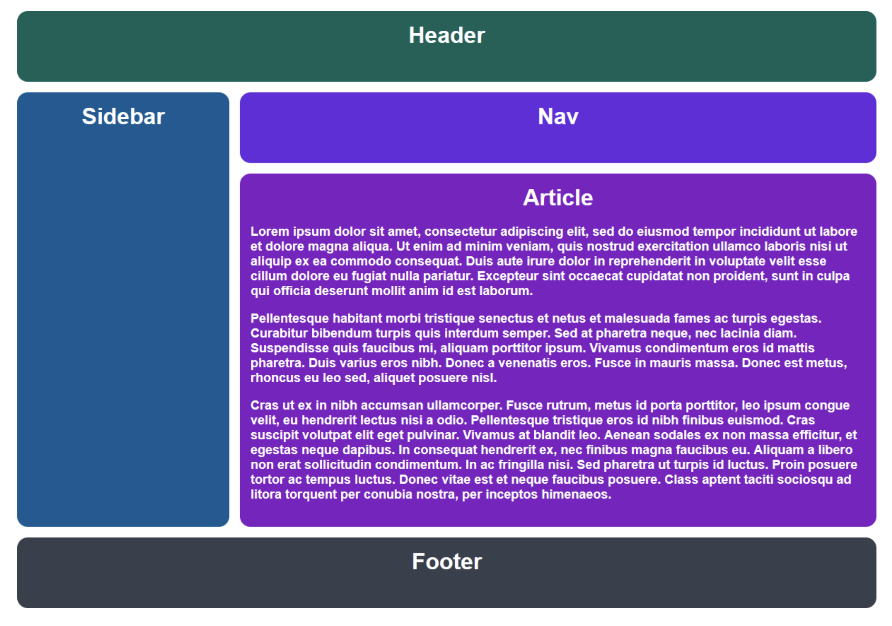
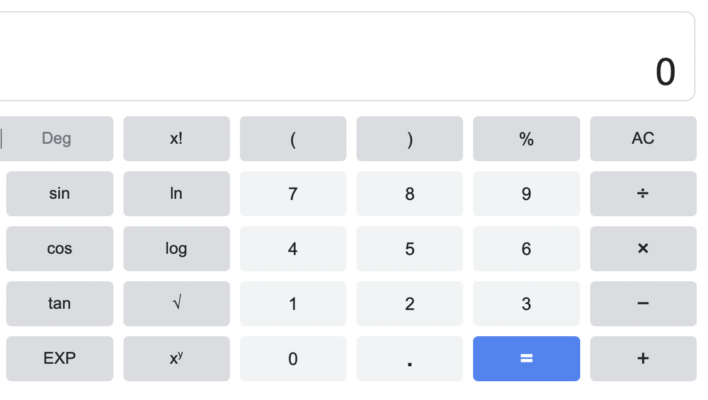

# CSC 318, HW 3 - Part 2 (Bootstrap)
Second part of the third homework assignment for CSC 318 (Internet Programming) course

**Name:** Talike Bennett

**Date Completed:** 06/14/2023

**Instructions:** 
You are to create the following layouts. Use CSS Grid for the first layout and make it responsive to both small and large screens. Use Bootstrap or any CSS framework for the second layout, also considering responsiveness for small and large screens.

**Completed Website:** https://tahbee03.github.io/csc318-hw3-pt2/